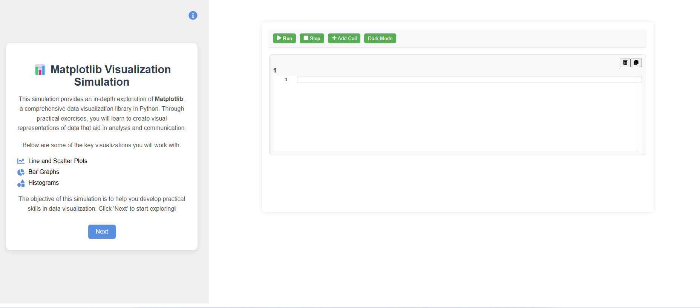
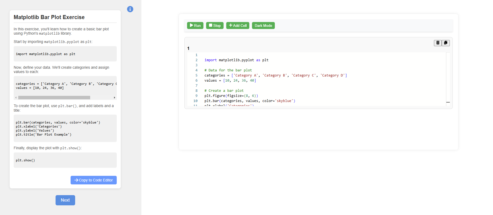
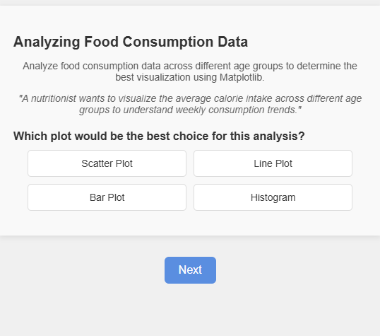
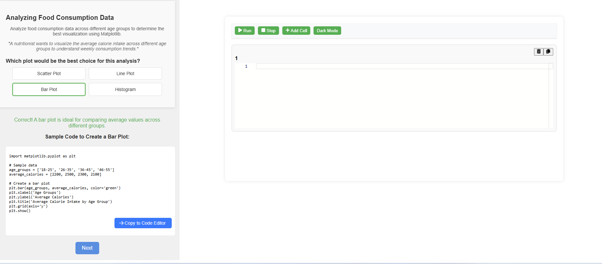
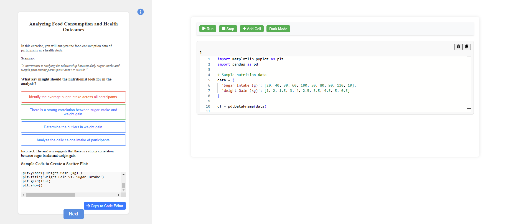

<strong>Step 1:</strong> Observe the code editor and read the instructions.

<strong>Step 2:</strong> Click the "Next" button to explore different Matplotlib plots such as bar plots, histograms, and line plots.

<strong>Step 3:</strong> Click the "Copy to Editor" button to try out the code in the code editor.

<strong>Step 4:</strong> Click the "Run" button in the code editor to observe the plot and read the insights.

<strong>Step 5:</strong> After completing the three plots, we will explore Matplotlib with some real-world scenarios.

<strong>Step 6:</strong> Read the instructions, choose the correct option, and after submitting, review the explanations provided.

<strong>Step 7:</strong> After completing the exercise, click the "Code to Editor" button to try the code in the code editor and observe the results.

